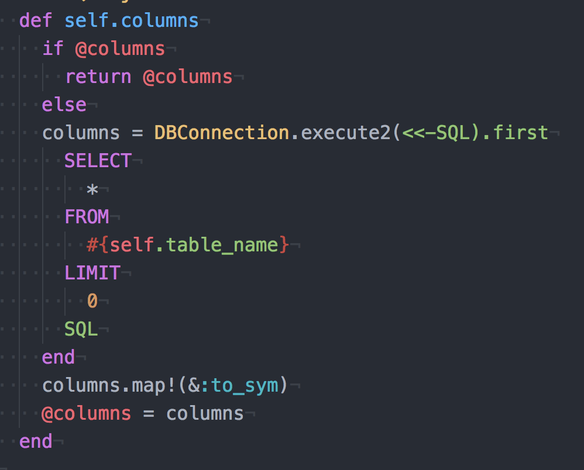
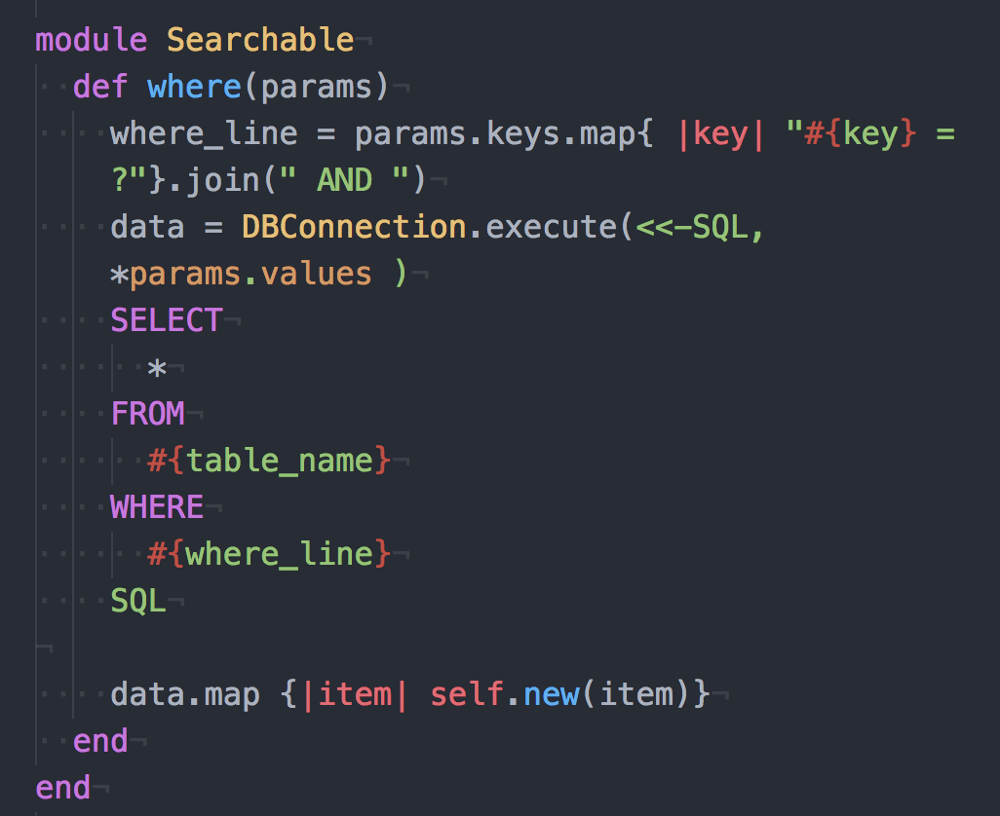
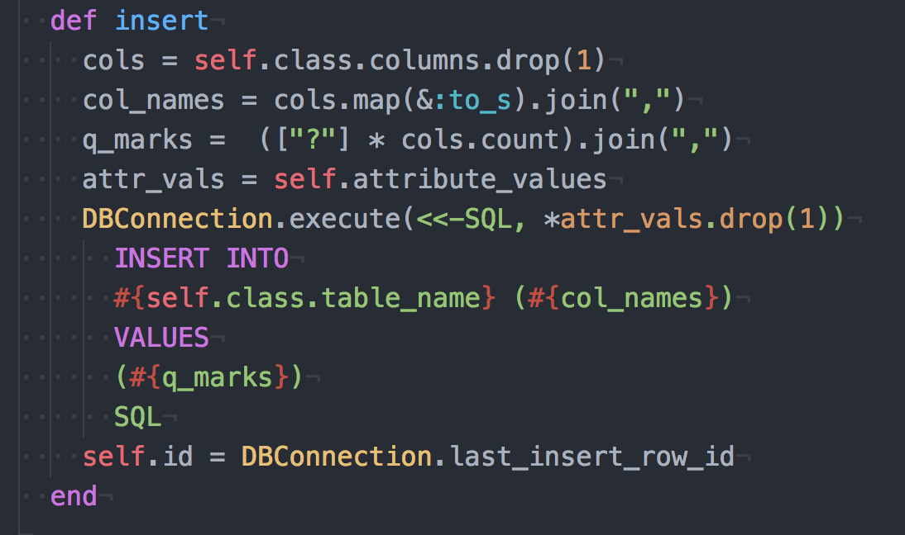
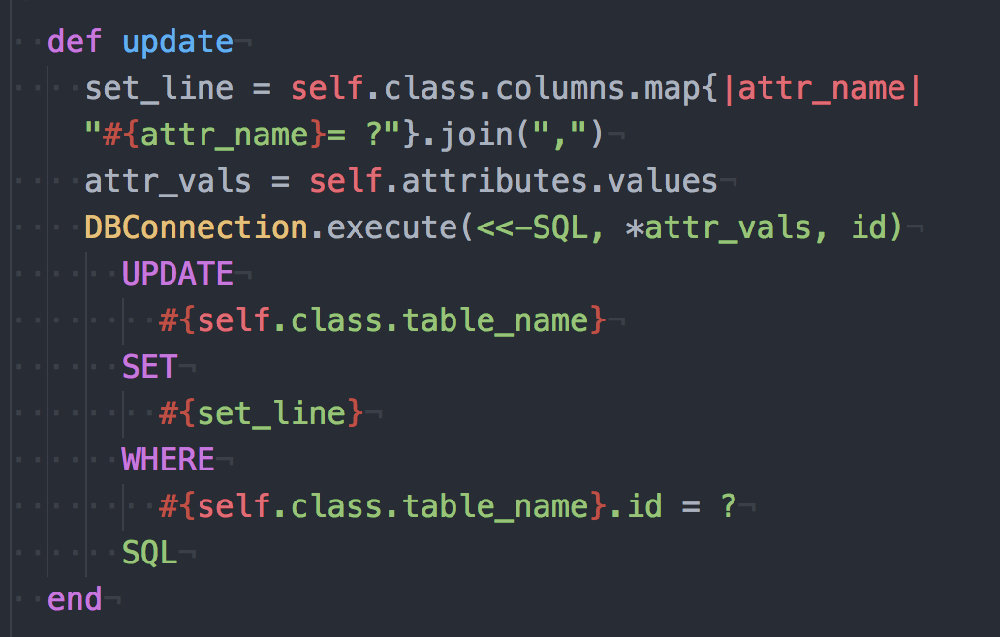
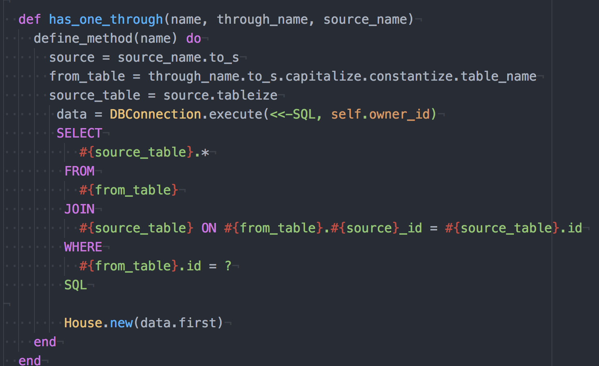

# ORMify
Inspired by Rails' ActiveRecordm Ormify is a lightweight Object-Relational Mapping (ORM) library for Ruby. To maintain DRY code and readability, Ormify queries the database in an object-oriented manner.

##Features
- Demonstrates similar core functionality of ActiveRecord::Base
- Implements an SQLObject class that abstracts table-specific logic away as seen below:
- Creates reusable  query methods that any class inheriting from SQLObject can use - eg `::where`
- Follows the 'convention over configuration' standard for naming when setting associations. e.g Will search schema for "yogis" table if given the "Yogi" class.

## How To Use
1. Clone the ORMify repo
2. cd into ORMify
3. Type `sqlite3 yogis.db < yogis.sql`
4. Type `sqlite3 yogis.db`
5. Open a new terminal tab and then load `pry` of `irb`
6. cd into `lib` and then type `load yogis.rb`
7. Please refer to the API below for the available, testable methods

## API

As previously mentioned, SQLObject provides similar core ActiveRecord associations:

- `has_many`
- `belongs_to`
- `has_one_through`

Additionally, the SQLObject has similar ActiveRecord methods:

* `::columns`: returns an array with the names of all the table's columns
* `::finalize!`: automatically adds getter and setter methods for each column.
* `#initialize`: iterates through each of the `attr_name`, `value` pairs. For each `attr_name`, converts the name to a symbol and then check whether the `attr_name` is among the columns - will otherwise throw and error
* `::all`: returns an array of all the records in the DB
* `::find`: looks up a single record by primary key
* `#insert`: inserts a new row into the table to represent the SQLObject.
* `#update`: updates the row with the id of this SQLObject
* `#save`: a convenience method that either calls insert/update depending on whether or not the SQLObject already exists in the table.

## View the Code

### `::columns`

### `::where`

### `#insert`

### `#update`

### `has_one_through`

